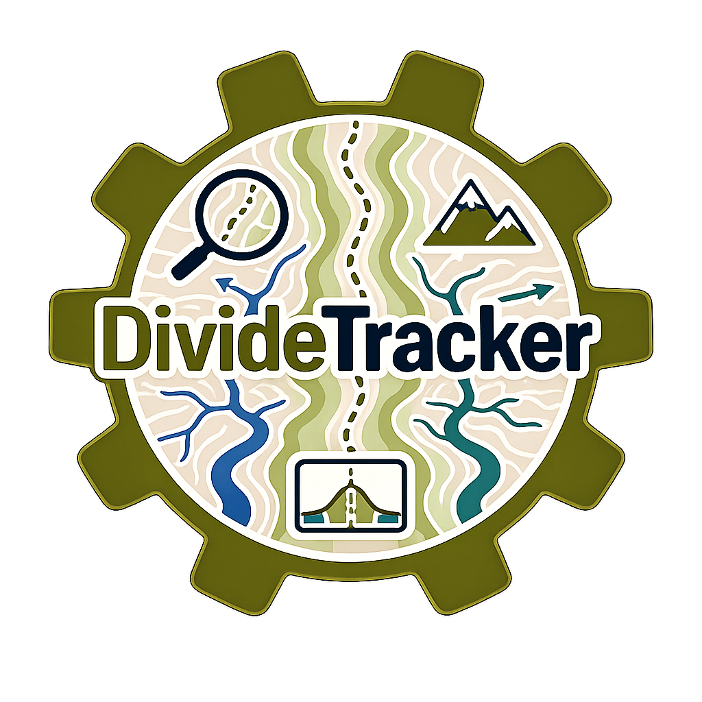
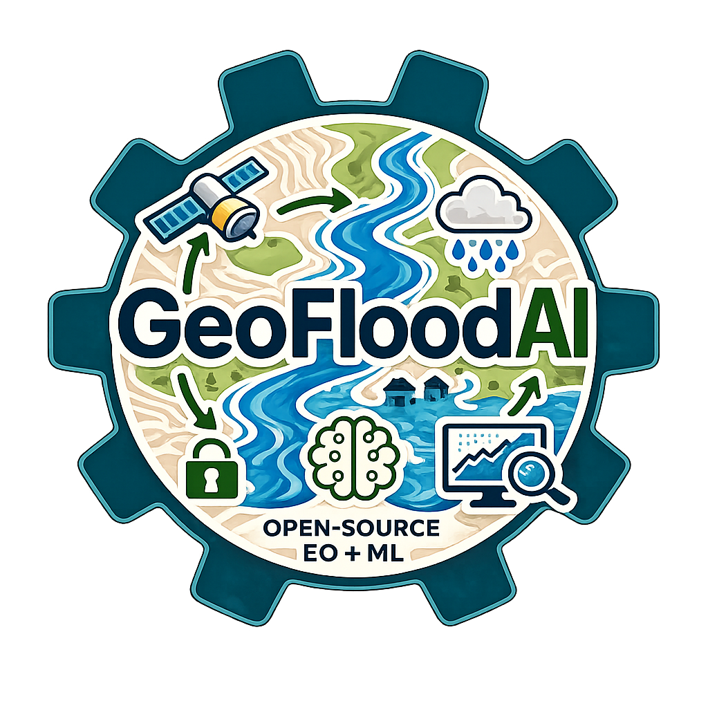

::::{grid} 1 1 2 2

:::{grid-item}
:columns: 12 12 4 4

```{image} img_avatar.png
:alt: Renato Da Silva
:width: 95%
```

:::

:::{grid-item}
:columns: 12 12 8 8

**PhD Candidate** | **Graduate Research & Teaching Assistant**

[Department of Earth and Environmental Science](https://www.gc.cuny.edu/people/renato-da-silva), The Graduate Center (CUNY)

[65-30 Kissena Blvd](https://maps.app.goo.gl/8UbakDzveSPWex6RA), Flushing, NY 11367

[rdasilva@gradcenter.cuny.edu](mailto:rdasilva@gradcenter.cuny.edu) | [github.com](https://github.com/renatovillela93)

**Research Interests:** GeoAI, Geomorphology, Data Science, Machine Learning, Open-Source Software Development, Cloud Computing

[CV (PDF)](cv.pdf) |
[Google Scholar](https://scholar.google.com/citations?user=CIByitcAAAAJ&hl=fr) |
[ORCID](https://orcid.org/0000-0002-1512-380X) |
[LinkedIn](https://www.linkedin.com/in/renatovillelamafra/) |
[GitHub](https://github.com/renatovillela93) |
[Twitter](https://twitter.com/username)

:::
::::

---

## Featured Projects

::::{grid} 2 2 4 4

:::{card}
:link: https://github.com/renatovillela93/RAG_OpenAI

+++
**DomainRAG**
:::

:::{card}
:link: https://jupyterbook.org

+++
**RiverCaptureFinder**
:::

:::{card}
:link: https://jupyter.org

+++
**DivideTracker**
:::

:::{card}
:link: https://python.org

+++
**GeoFloodAI**
:::

::::

---

## Highlights

::::{grid} 2 2 3 4

:::{card} Publications 📚
:link: pages/research
Refereed Publications
:::

:::{card} Software 💻
:link: pages/software
Open-Source Projects
:::

:::{card} Teaching 🎓
:link: pages/teaching
Courses Taught
:::

:::{card} Awards 🏆
:link: pages/awards
Awards & Honors
:::

:::{card} Blog ✍️
:link: pages/blog
Thoughts on research, software, and teaching
:::

:::{card} News 📰
:link: pages/news
Latest updates and milestones
:::

::::

---

## Recent News

- **2026-04-01** - Launched personal website with MyST Markdown
- **2026-03-15** - Published new paper on machine learning
- **2026-02-01** - Released version 2.0 of open-source project
- **2026-01-10** - Received Best Paper Award at Conference 2026

[See all news →](pages/news)
