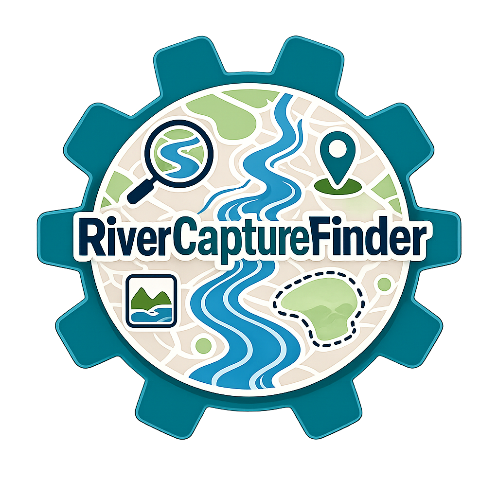

# Open-Source Software

Renato Da Silva is the creator and maintainer of several open-source software packages of data science and machine learning applied to Geosciences.

---

## Featured Projects

::::{grid} 2 2 4 4

:::{card}
:link: https://github.com/renatovillela93/RAG_OpenAI

+++
**DomainRAG**
:::

:::{card}
:link: https://jupyterbook.org

+++
**RiverCaptureFinder**
:::

:::{card}
:link: https://jupyter.org

+++
**DivideTracker**
:::

:::{card}
:link: https://python.org

+++
**GeoFloodAI**
:::

::::

---

## Python Packages

::::{grid} 1 2 3 3

:::{card} project-alpha
:link: https://github.com/username/project-alpha
A Python package for data analysis and visualization
:::

:::{card} project-beta
:link: https://github.com/username/project-beta
Machine learning utilities for scientific computing
:::

:::{card} project-gamma
:link: https://github.com/username/project-gamma
Cloud computing tools for large-scale data processing
:::

::::

---

## Web Apps

::::{grid} 1 2 3 3

:::{card} data-dashboard
:link: https://github.com/username/data-dashboard
Interactive data visualization dashboard
:::

:::{card} ml-explorer
:link: https://github.com/username/ml-explorer
Machine learning model exploration tool
:::

::::
